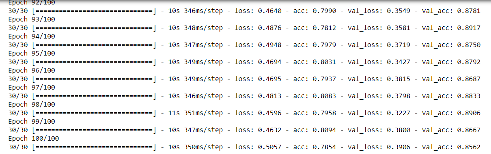

# Squat Detector using Deep Learning


## Demo

 

Video source:
[Video Demo ](https://github.com/Hsu-Hui/keras-squat-demo/blob/main/squat.mp4)

## Install

```bash
$ pip install tensorflow
```

## Collecting Dataset
Collect 320 pictures in three categories in different backgrounds and different costumes:
- Upper: Standing,and knee bend angle is greater than 160 degrees.
- Middle: Start squatting, bend the knees at an angle of about 90 degrees.
- Lower: Squating, knee bend angle is less than 60 degrees.

A total of  960 squat decomposition actions.

## Training model
The input shape is 320x240x1,and following figure is the training result.
 
As you see I have validation loss 0.3906 and validation accuracy ~80%.

## Model


## Counting Squats
Run the model on a video stream, and just count the cycles as I described above:

__Upper -> Middle -> Down ->Upper__

This cycle would be a one correct squat.